```mermaid
flowchart TB
    %% Define subgraphs for logical grouping
    subgraph Core_Services
        mainService["🖥️ **mainService** (8080)"]
        guestBookService["🖥️ **guestBookService** (8081)"]
        dataBaseService["🖥️ **dataBaseService** (8082)"]
    end

    subgraph Database
        mysql["🛢️ **MySQL** (3306)"]
    end

    subgraph Messaging
        rabbitmq["📨 **RabbitMQ** (5672)"]
    end

    subgraph Communication
        emailservice["📧 **emailService** (8083)"]
    end

    %% Define connections
    mainService -->|Depends On| guestBookService
    mainService -->|Depends On| dataBaseService
    guestBookService -->|Depends On| dataBaseService
    dataBaseService -->|Uses| mysql
    mainService -->|Sends Messages To| rabbitmq
    rabbitmq -->|Sends Messages To| emailservice

    %% Styling for larger elements and spacing
    classDef largeNode font-size:32px, font-weight:bold, fill:#f0f0f0, stroke:#333, stroke-width:2px;
    classDef largeEdge stroke-width:2px, stroke:#333;

    class mainService,guestBookService,dataBaseService,mysql,rabbitmq,emailservice largeNode;
```

---
# You can also start simply with 'default'
#theme: seriph
# random image from a curated Unsplash collection by Anthony
# like them? see https://unsplash.com/collections/94734566/slidev
#background: https://cover.sli.dev
# some information about your slides (markdown enabled)
title: Demystifying OpenTelemetry, Java Agents Unveiled
info: |
  ## Slidev Starter Template
  Presentation slides for developers.

  Learn more at [Sli.dev](https://sli.dev)
# apply unocss classes to the current slide

# https://sli.dev/features/drawing
drawings:
  persist: false
# slide transition: https://sli.dev/guide/animations.html#slide-transitions
transition: slide-up
# enable MDC Syntax: https://sli.dev/features/mdc
mdc: true
# <!-- Empty slide -->
layout: center
---

<h1 class="headline">Demystifying OpenTelemetry: Java Agents Unveiled</h1> 
<h2 class="headline-smol">Marco Sussitz</h2>

Senior Software Developer at Dynatrace

  

    

---
layout: center
transition: slide-up
---

---
layout: iframe
url: ./htmldocs/first-diagram.html
---

---
layout: iframe
url: ./htmldocs/docker-compose-overview.html
---

